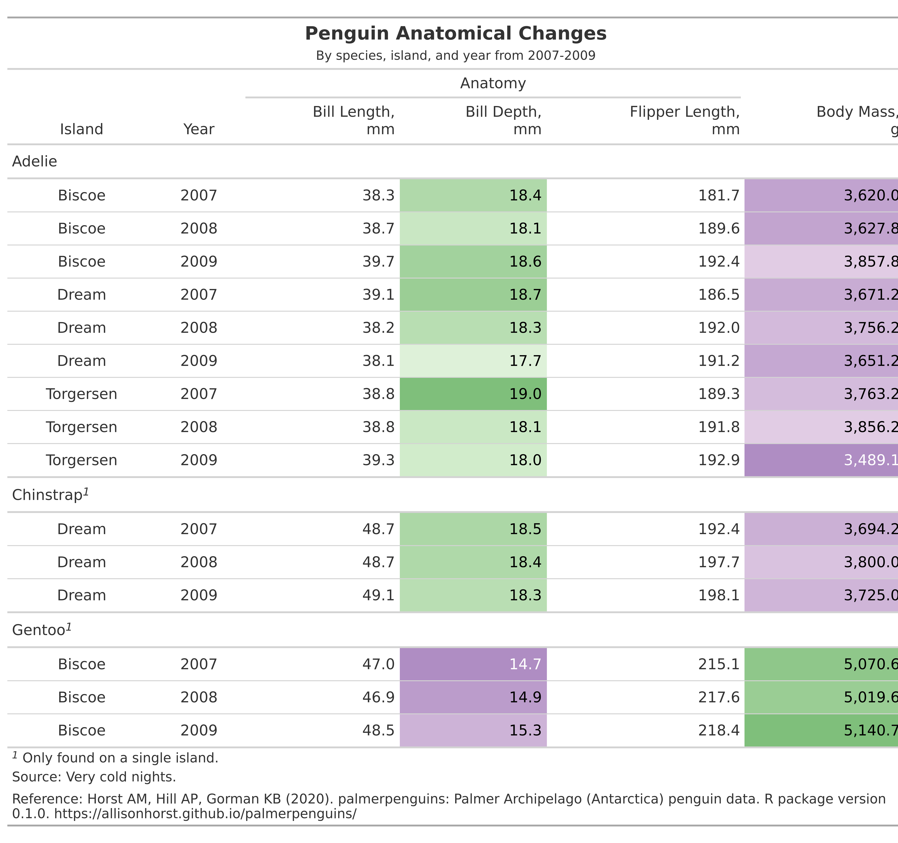

```{r setup, include=FALSE}
knitr::opts_chunk$set(echo = TRUE)
```

```{r data, message=FALSE, warning=FALSE, include=FALSE, paged.print=FALSE}

# load a package into the session for use
library(tidyverse)
library(plotly)
library(palmerpenguins)
library(gt)
library(gtExtras)
library(lubridate)

# read a CSV file that is online or on disk
dat <- readr::read_csv('penguins_raw.csv')

```

```{r cleaning, message=FALSE, warning=FALSE, include=FALSE, paged.print=FALSE}

# drop a column that has no values
dat <- dat %>% 
  select(-Comments)

# filter out rows with no sex
dat <- dat %>% 
  filter(!is.na(Sex))

# str(knitr::opts_chunk$get())

```

# Species by Island

```{r bar, echo=FALSE, fig.width=12, message=FALSE, warning=FALSE, paged.print=FALSE}

# bar plot
dat %>%
  ggplot(aes(x = Island, fill = Species)) +
  geom_bar() + 
  labs(
    title = "Where Do They Live?",
    subtitle = "by Island",
    caption = "data from palmerpenguines R package"
  )

```

```{r echo=FALSE, message=FALSE, warning=FALSE, paged.print=FALSE, results='asis'}
# have a remote analyst write content that you can source into this doc
cat(read_lines(file = "interpret_islands.txt"))
```

# Understanding Penguin Anatomy

```{r scatter, echo=FALSE, fig.width=10, message=FALSE, warning=FALSE, paged.print=FALSE}

# scatter plot, add titles
length_mass <- dat %>% 
  ggplot(aes(x = `Flipper Length (mm)`, y = `Body Mass (g)`, color = Species)) +
  geom_point(alpha = .4) +
  labs(
    title = "Is Flipper Length Associated With Body Mass?",
    subtitle = "by species",
    caption = "data from palmerpenguines R package"
  ) +
  theme_light()

length_mass

```

# Summary Table

## A Closer Look at `gt`

-   the interface is high-level and declarative (general instructions versus very specific)
-   the formatting options are 'batteries included' (scientific notation, uncertainty, ranges, percentages, suffixes, localized currency, dates/times + much more)
-   there is excellent, pain-free support for footnotes
-   the output is 'camera-ready'
-   multiple output formats are supported with the same declarative interface
-   the API closely follows tidyverse conventions by adhering to the tidyverse style guide
-   there's a focus on making the package documentation and examples the best they can be
-   rigorous QA/QC measures: high test coverage for automated tests, and thorough manual testing by QA engineers (with every proposed code change)

```{r table, echo=FALSE, message=FALSE, warning=FALSE, paged.print=FALSE}

# make a table of our data
# but let's summarize by year, so first make a year column
dat <- penguins %>%
  dplyr::arrange(year) %>% 
  mutate(year = as.factor(year)) %>% 
  group_by(species, island, year) %>% # order here will influence table output
  summarise(across(bill_length_mm:body_mass_g, ~ mean(., na.rm = TRUE))) %>%
  select(species, island, year, everything()) %>% 
  dplyr::arrange(species, island, year) %>% 
  ungroup() # experiment with and without

# table using gt package
dat %>% 
gt() %>%
tab_header(
  title = md("**Penguin Anatomical Changes**"),
  subtitle = "By species, island, and year from 2007-2009"
) %>%
fmt_number(
  columns = bill_length_mm:body_mass_g,
  decimals = 1
)

```

## Parts of `gt` table

-   the Table Header (optional; with a title and possibly a subtitle)
-   the Stub and the Stub Head (optional; contains row labels, optionally within row groups having row group labels and possibly summary labels when a summary is present)
-   the Column Labels (contains column labels, optionally under spanner column labels)
-   the Table Body (contains columns and rows of cells)
-   the Table Footer (optional; possibly with footnotes and source notes)

**Right now we don't have a Stub or footer, so let's add those**

-   A source note can be added to the table's footer through use of the tab_source_note() function.
-   Footnotes live inside the Footer part and their footnote marks are attached to cell data. Footnotes are added with the tab_footnote() function.

```{r notes, echo=FALSE, message=FALSE, warning=FALSE, paged.print=FALSE}

# table using gt package
dat %>% 
  gt() %>%
  tab_header(
    title = md("**Penguin Anatomical Changes**"),
    subtitle = "By species, island, and year from 2007-2009"
  ) %>%
  fmt_number(
    columns = bill_length_mm:body_mass_g,
    decimals = 1
  ) %>% 
  tab_source_note(
    source_note = "Source: Very cold nights."
  ) %>%
  tab_source_note(
    source_note = md("Reference: Horst AM, Hill AP, Gorman KB (2020). palmerpenguins: Palmer Archipelago (Antarctica) penguin data. R package version 0.1.0. https://allisonhorst.github.io/palmerpenguins/")
  ) %>% 
  tab_footnote(
    footnote = "Only found on a single island.",
    locations = cells_body(columns = species, rows = c(10,13))
  )


```

Note that in rows = c(10,13) you can use an expression instead of naming rows.

## Stubs

The Stub is the area to the left in a table that contains row labels, and may contain row group labels, and summary labels. Those subparts can be grouped in a sequence of row groups.

```{r stub, echo=FALSE, message=FALSE, warning=FALSE, paged.print=FALSE}

# table using gt package
dat %>% 
  gt(rowname_col = "species") %>% # the Stub!
  tab_stubhead(label = "species") %>% # and Stbuhead!
  tab_header(
    title = md("**Penguin Anatomical Changes**"),
    subtitle = "By species, island, and year from 2007-2009"
  ) %>%
  fmt_number(
    columns = bill_length_mm:body_mass_g,
    decimals = 1
  ) %>% 
  tab_source_note(
    source_note = "Source: Very cold nights."
  ) %>%
  tab_source_note(
    source_note = md("Reference: Horst AM, Hill AP, Gorman KB (2020). palmerpenguins: Palmer Archipelago (Antarctica) penguin data. R package version 0.1.0. https://allisonhorst.github.io/palmerpenguins/")
  ) %>% 
  tab_footnote(
    footnote = "Only found on a single island.",
    locations = cells_body(columns = species, rows = c(10,13))
  )

```

## Add a tab spanner over some column labels

and change some of the column labels

```{r labels, echo=FALSE, message=FALSE, warning=FALSE, paged.print=FALSE}

# table using gt package
dat %>% 
  gt(rowname_col = "species") %>%
  tab_stubhead(label = "species") %>%
  tab_header(
    title = md("**Penguin Anatomical Changes**"),
    subtitle = "By species, island, and year from 2007-2009"
  ) %>%
  tab_spanner( # tab spanner!
    label = "Anatomy",
    columns = c(bill_length_mm:flipper_length_mm)
  ) %>% 
  fmt_number(
    columns = bill_length_mm:body_mass_g,
    decimals = 1
  ) %>% 
  tab_source_note(
    source_note = "Source: Very cold nights."
  ) %>%
  tab_source_note(
    source_note = md("Reference: Horst AM, Hill AP, Gorman KB (2020). palmerpenguins: Palmer Archipelago (Antarctica) penguin data. R package version 0.1.0. https://allisonhorst.github.io/palmerpenguins/")
  ) %>% 
  tab_footnote(
    footnote = "Only found on a single island.",
    locations = cells_body(columns = species, rows = c(10,13))
  ) %>%
  cols_label( # new column labels!
    bill_length_mm = html("Bill Length,<br>mm"),
    bill_depth_mm = html("Bill Depth,<br>mm"),
    flipper_length_mm = html("Flipper Length,<br>mm"),
    body_mass_g = html("Body Mass,<br>g"),
    species = "Species", # but this did not do anything! Remember why?
    island = "Island",
    year = "Year"
  )
```

## Row groups

instead of repeating the species on each line, let's drop the stub info and in `dplyr` group by species, which `gt` will recognize

```{r groups, echo=FALSE, message=FALSE, warning=FALSE, paged.print=FALSE}

# table using gt package
dat %>% 
  dplyr::group_by(species) %>% # add a grouping variable and drop stub info
  #gt(rowname_col = "species") %>%
  #tab_stubhead(label = "species") %>%
  gt() %>% 
  tab_header(
    title = md("**Penguin Anatomical Changes**"),
    subtitle = "By species, island, and year from 2007-2009"
  ) %>%
  tab_spanner( # tab spanner!
    label = "Anatomy",
    columns = c(bill_length_mm:flipper_length_mm)
  ) %>% 
  fmt_number(
    columns = bill_length_mm:body_mass_g,
    decimals = 1
  ) %>% 
  tab_source_note(
    source_note = "Source: Very cold nights."
  ) %>%
  tab_source_note(
    source_note = md("Reference: Horst AM, Hill AP, Gorman KB (2020). palmerpenguins: Palmer Archipelago (Antarctica) penguin data. R package version 0.1.0. https://allisonhorst.github.io/palmerpenguins/")
  ) %>% 
  tab_footnote(
    footnote = "Only found on a single island.",
    locations = cells_body(columns = species, rows = c(10,13))
  ) %>%
  cols_label( # new column labels!
    bill_length_mm = html("Bill Length,<br>mm"),
    bill_depth_mm = html("Bill Depth,<br>mm"),
    flipper_length_mm = html("Flipper Length,<br>mm"),
    body_mass_g = html("Body Mass,<br>g"),
    species = "Species", # but this did not do anything! Remember why?
    island = "Island",
    year = "Year"
  )

```

## Easy colors with `gtExtras`
https://jthomasmock.github.io/gtExtras/

```{r extras, echo=FALSE, message=FALSE, warning=FALSE, paged.print=FALSE}

# table using gt package
dat %>% 
  dplyr::group_by(species) %>% # add a grouping variable and drop stub info
  #gt(rowname_col = "species") %>%
  #tab_stubhead(label = "species") %>%
  gt() %>% 
  tab_header(
    title = md("**Penguin Anatomical Changes**"),
    subtitle = "By species, island, and year from 2007-2009"
  ) %>%
  tab_spanner( # tab spanner!
    label = "Anatomy",
    columns = c(bill_length_mm:flipper_length_mm)
  ) %>% 
  fmt_number(
    columns = bill_length_mm:body_mass_g,
    decimals = 1
  ) %>% 
  tab_source_note(
    source_note = "Source: Very cold nights."
  ) %>%
  tab_source_note(
    source_note = md("Reference: Horst AM, Hill AP, Gorman KB (2020). palmerpenguins: Palmer Archipelago (Antarctica) penguin data. R package version 0.1.0. https://allisonhorst.github.io/palmerpenguins/")
  ) %>% 
  tab_footnote(
    footnote = "Only found on a single island.",
    locations = cells_body(columns = species, rows = c(10,13))
  ) %>%
  # trim gives smaller range of colors
  # so the green and purples are not as dark
  gt_hulk_col_numeric(bill_depth_mm, trim = TRUE) %>%  # gtExtras!
  gt_hulk_col_numeric(body_mass_g, trim = TRUE) %>%  # gtExtras!
  cols_label( # new column labels!
    bill_length_mm = html("Bill Length,<br>mm"),
    bill_depth_mm = html("Bill Depth,<br>mm"),
    flipper_length_mm = html("Flipper Length,<br>mm"),
    body_mass_g = html("Body Mass,<br>g"),
    island = "Island",
    year = "Year"
  )

```


```{r eval=FALSE, message=FALSE, warning=FALSE, include=FALSE, paged.print=FALSE}

#gt::as_rtf(pt)
#gt::as_latex(pt)

# gtsave(pt, "pt_as_pdf.pdf")
# gtsave(pt, "pt_as_rtf.rtf")

```

```{r save_pt, message=FALSE, warning=FALSE, include=FALSE, paged.print=FALSE}
# need to install webshot and also run webshot::install_phantomjs()
gtsave(pt, "pt_as_image.png", expand = 25, zoom = 6)

```

```{r show_table, echo=TRUE, message=FALSE, warning=FALSE, paged.print=FALSE}

```

more about the gt package at <https://gt.rstudio.com/index.html>

# References

Horst AM, Hill AP, Gorman KB (2020). palmerpenguins: Palmer Archipelago (Antarctica) penguin data. R package version 0.1.0. <https://allisonhorst.github.io/palmerpenguins/>

# LaTeX Output of the Table

```{r echo=TRUE, message=FALSE, warning=FALSE, paged.print=FALSE}

gt::as_latex(pt) %>%
  as.character() %>%
  cat()

```
